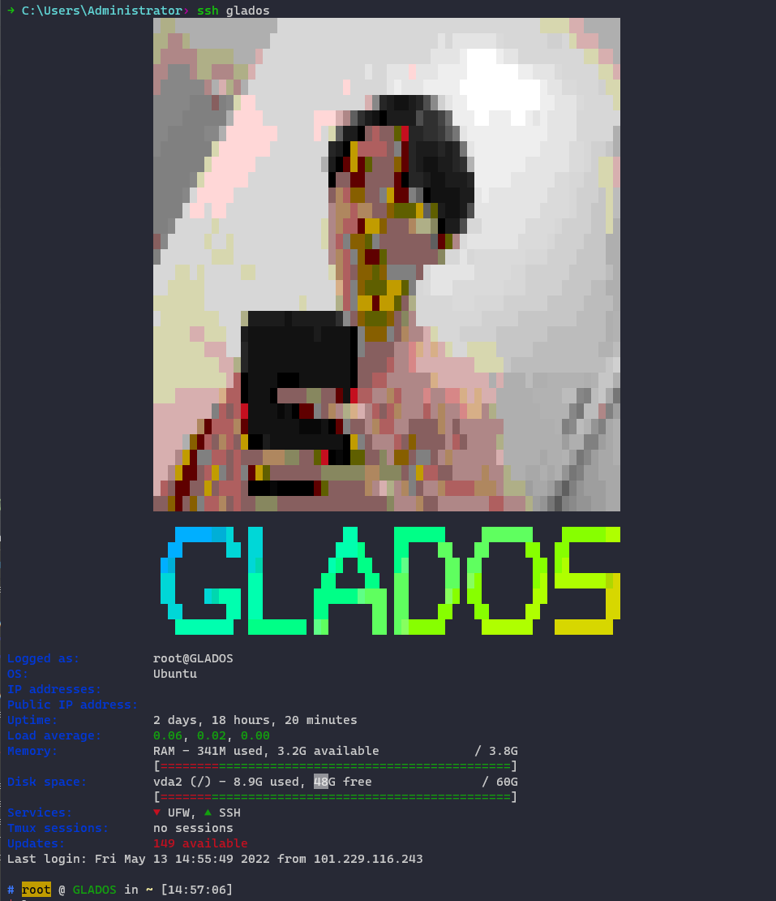

## Usage

### Running
Clone the repository:
```shell
git clone https://github.com/tywhisky/motd.git
```

Then run `motd.sh`:
```shell
./motd/motd.sh
```

This runs all the scripts in `modules` directory in order, `run-parts` style, and formats the output.

If any modules are missing in your output, plese see [requirements](#requirements).

You can also pass the config file path as the script argument (see [configuration](#configuration)):
```shell
ln -S ./motd/motd.sh /etc/update-motd.d/10-motd
```

### Requirements
In order to run all the available modules the following programs are required:

* [`figlet`](http://www.figlet.org/)
* [`curl`](https://curl.se/)
* [`bc`](https://www.gnu.org/software/bc/)
* [`fortune`](https://software.clapper.org/fortune/)

This list excludes the obvious ones, like [`tmux`](https://github.com/tmux/tmux) for `tmux` module.

If any program requried by the given module is missing (or any other error occurs), it will fail silently, i.e. the module just won't be shown at all.

## Hacking
To add a new module you can create a new script in `modules` directory.
For the output to be properly formatted it has to use `print_columns` function from `framework.sh`, please refer to the existing modules.

Module files have to start with a two digit number followed by a hyphen. You may disable modules by simply rename the module file.

## Credits
This MOTD is hugely inspired by [this repo](https://github.com/bcyran/fancy-motd) by Bazyli Cyran.
